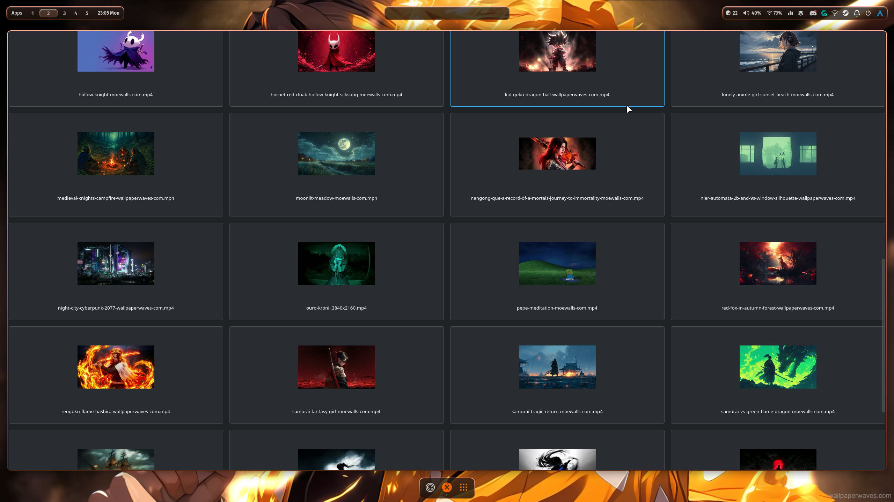

<p align="center">
  
</p>

<h1 align="center">HyprWall</h1>

<p align="center">
A modern GTK4 video wallpaper picker for Hyprland powered by <b>mpvpaper</b>.
</p>

<p align="center">


</p>

---

# 📷 Preview

<p align="center">

</p>

---

# ✨ Features

- 🎥 Video wallpaper support
- ⚡ One-click wallpaper switching
- 🖼 Automatic thumbnail generation
- 🐧 Native GTK4 interface
- 🚀 Lightweight
- 💙 Designed for Hyprland
- 🎬 mpvpaper backend

---

# 📦 Requirements

Arch Linux / CachyOS

```bash
sudo pacman -S python python-gobject gtk4 libadwaita ffmpeg mpvpaper
```

---

# 🚀 Installation

Clone repository

```bash
git clone https://github.com/KendrickMathers/hyprwall-ilham.git
```

Enter project

```bash
cd hyprwall-ilham
```

Run

```bash
python main.py
```

---

# 📂 Project Structure

```text
HyprWall
├── assets
│   └── logo.png
├── screenshots
│   └── main.jpg
├── apply.sh
├── thumbnail.py
├── main.py
├── requirements.txt
├── LICENSE
└── README.md
```

---

# 🛣 Roadmap

- [x] Video wallpaper
- [x] GTK4 UI
- [x] Thumbnail generation
- [x] One-click apply
- [ ] Favorites
- [ ] Search
- [ ] Hover preview
- [ ] Multi-monitor support
- [ ] Wallpaper history

---

# 📄 License

Released under the MIT License.

---

<p align="center">
Made with ❤️ for the Hyprland community.
</p>
